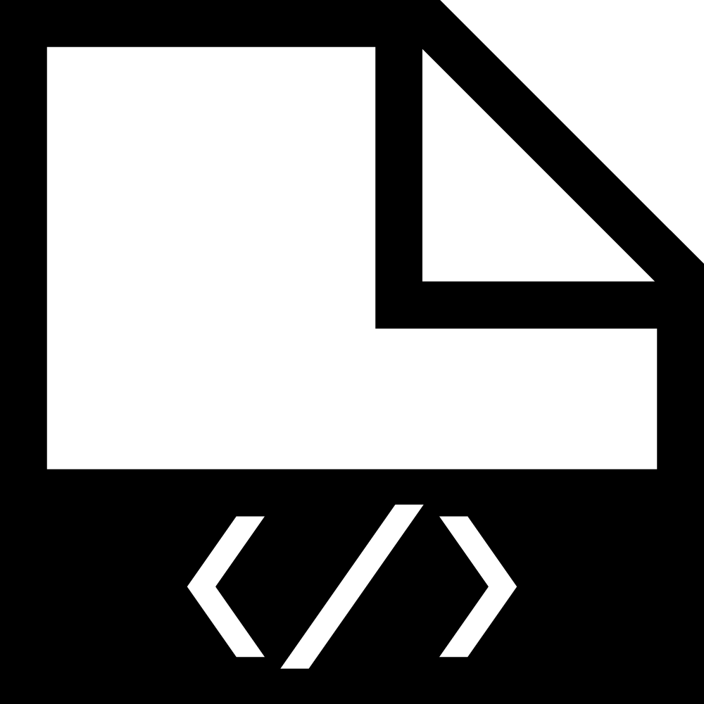

Helix is a Rackspace chartered effort to unify the look, feel, and
functionality of our interfaces&mdash;one system composed of this Helix design
library for designers and a UI toolkit for developers. Together, we make
customers happy.

  

    

      

      For Designers
      
Start making stuff with these tools now.

      <ul>
        <li><a href="#">Pattern Guidelines</a></li>
        <li><a href="#">Sketch Resources</a></li>
      </ul>
    

  

  

    

      

      For Developers
      
Use these resources to learn and implement Helix patterns.

      <ul>
        <li><a href="#">Pattern Guidelines</a></li>
        <li><a href="#">UI Framework</a></li>
        <li><a href="#">Component Explorer</a></li>
      </ul>
    

  

